# SRGAN-tensorflow

### Introduction
This project is a tensorflow implementation of the impressive work  [Photo-Realistic Single Image Super-Resolution Using a Generative Adversarial Network](https://arxiv.org/pdf/1609.04802.pdf). <br />
The result is obtained following to same setting from the v5 edition of the [paper on arxiv](https://arxiv.org/pdf/1609.04802.pdf). However, due to limited resources, I train my network on the [RAISE dataset](http://mmlab.science.unitn.it/RAISE/) which contains 8156 high resoution images captured by good cameras. As the results showed below, the performance is close to the result presented in the paper without using the imagenet training set. <br />
The result on BSD100, Set14, Set5 will be reported later. The code is highly inspired by the [pix2pix-tensorflow](https://github.com/affinelayer/pix2pix-tensorflow).

#### Some results:
* The comparison of some result form my implementation and the paper

<table >
    <tr >
    	<td><center>Inputs</center></td>
        <td><center>Our result</center></td>
        <td><center>SRGAN result</center></td>
        <td><center>Original</center></td>
    </tr>
    <tr>
    	<td>
    		<center></center>
    	</td>
    	<td>
    		<center></center>
    	</td>
        <td>
        	<center></center>
        </td>
        <td>
        	<center></center>
        </td>
    </tr>
    <tr>
    	<td><center>Inputs</center></td>
        <td><center>Our result</center></td>
        <td><center>SRGAN result</center></td>
        <td><center>Original</center></td>
    </tr>
    <tr>
    	<td>
    		<center></center>
    	</td>
        <td>
        	<center>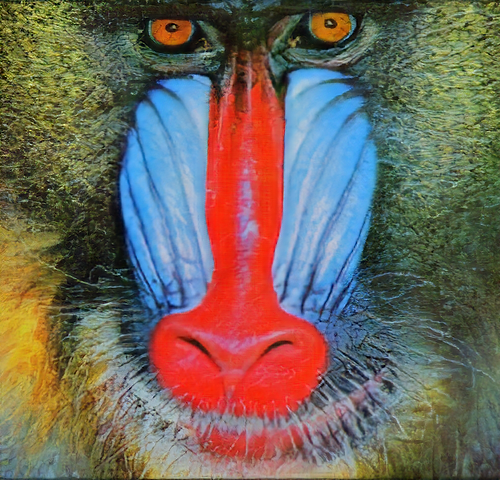</center>
        </td>
        <td>
        	<center>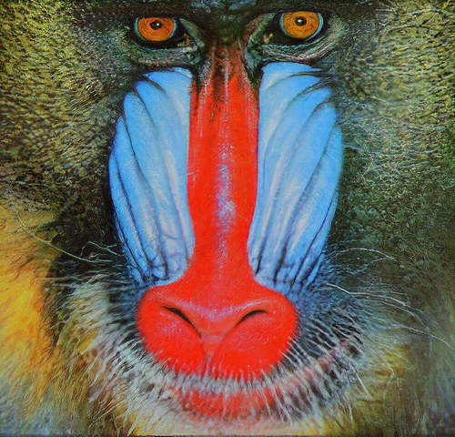</center>
       </td>
       <td>
        	<center></center>
        </td>
    </tr>
</table>

### Denpendency
* python2.7
* tensorflow (tested on r1.0, r1.2)
* Download and extract the pre-trained model from my [google drive](https://drive.google.com/a/gapp.nthu.edu.tw/uc?id=0BxRIhBA0x8lHNDJFVjJEQnZtcmc&export=download)
* Download the VGG19 weights from the [TF-slim models](http://download.tensorflow.org/models/vgg_19_2016_08_28.tar.gz)
* The code is tested on:
	* Ubuntu 14.04 LTS with CPU architecture x86_64 + Nvidia Titan X
	* Ubuntu 16.04 LTS with CPU architecture x86_64 + Nvidia 1080, 1080Ti or Titan X


### Recommended
* Ubuntu 16.04 with tensorflow GPU edition

### Getting Started
Throughout the project, we denote the directory you cloned the repo as ```SRGAN-tensorflow_ROOT```<br />

* #### Run test using pre-trained model
```bash
# clone the repository from github
git clone https://github.com/brade31919/SRGAN-tensorflow.git
cd $SRGAN-tensorflow_ROOT/

# Download the pre-trained model from the google-drive
# Go to https://drive.google.com/a/gapp.nthu.edu.tw/uc?id=0BxRIhBA0x8lHNDJFVjJEQnZtcmc&export=download
# Download the pre-trained model to SRGAN-tensorflow/
tar xvf SRGAN_pre-trained.tar

# Run the test mode
sh test_SRGAN.sh

#The result can be viewed at $SRGAN-tensorflow_ROOT/result/images/
```
<br />

* #### Run the inference using pre-trained model on your own image
```bash
cd $SRGAN-tensorflow_ROOT/

# Download the pre-trained model from the google-drive
# Go to https://drive.google.com/a/gapp.nthu.edu.tw/uc?id=0BxRIhBA0x8lHNDJFVjJEQnZtcmc&export=download
# Download the pre-trained model to SRGAN-tensorflow/
tar xvf SRGAN_pre-trained.tar

# put your png images in the your own directory
# For example
mkdir myImages
# put some images in it
```
modify the path in inference_SRGAN.sh
```bash
#!/usr/bin/env bash
CUDA_VISIBLE_DEVICES=0 python main.py \
    --output_dir ./result/ \
    --summary_dir ./result/log/ \
    --mode inference \
    --is_training False \
    --task SRGAN \
    --input_dir_LR ./data/myImages/ \        # Modify the path to your image path
    --num_resblock 16 \
    --perceptual_mode VGG54 \
    --pre_trained_model True \
    --checkpoint ./SRGAN_pre-trained/model-200000

```
```bash
# Run the test mode
sh inference_SRGAN.sh

#The result can be viewed at $SRGAN-tensorflow_ROOT/result/images/
```
<br />

* #### Run the training process

#### Data and checkpoint preparation
To run the training process, things will become a little complicated. Follow the steps below carefully!!<br />
Go to the project root directory. Download the vgg weight from [TF-silm model](http://download.tensorflow.org/models/vgg_19_2016_08_28.tar.gz)<br />
 
```bash
# make the directory to put the vgg19 pre-trained model
mkdir vgg19/
cd vgg19/
wget http://download.tensorflow.org/models/vgg_19_2016_08_28.tar.gz
tar xvf ./vgg19_2016_08_28.tar.gz
```
Download the training dataset. The dataset contains the 8156 images from the RAISE dataset. I preprocess all the TIFF images into png with 5x downscale as the high-resolution images. The low-resolution image is obtained by 4x downscale of the high-resolution image. <br />
Download the two file from the google drive link: <br />
[High-resolution images](https://drive.google.com/file/d/0BxRIhBA0x8lHYXNNVW5YS0I2eXM/view?usp=sharing)<br />
[Low-resolution images](https://drive.google.com/file/d/0BxRIhBA0x8lHNnJFVUR1MjdMWnc/view?usp=sharing)<br />
Put the two .tar files to SRGAN/data/. Go to project root (SRGAN/)<br />

Typically, we need to follow the training process in the paper
 1. Train the SRResnet with 1000000 iterations
 2. [optional] Train the SRGAN with the weights from the generator of SRResnet for 500000 iterations using the **MSE loss**.
 3. Train the SRGAN with the weights from the generator and discriminator of SRGAN (MSE loss) for 200000 iterations using the  **VGG54 perceptual loss**.
 
#### Train SRResnet
Edit the train_SRResnet.sh
```bash
#!/usr/bin/env bash
CUDA_VISIBLE_DEVICES=0 python main.py \  #Set CUDA devices correctly if you use multiple gpu system
    --output_dir ./experiment_SRResnet/ \  #Set the place to put the checkpoint and log. You can put it anywhere you like.
    --summary_dir ./experiment_SRResnet/log/ \
    --mode train \ 
    --is_training True \ 
    --task SRResnet \
    --batch_size 16 \
    --flip True \                        #flip and random_crop are online data augmentation method 
    --random_crop True \
    --crop_size 24 \
    --input_dir_LR ./data/RAISE_LR/ \    #Set the training data path correctly
    --input_dir_HR ./data/RAISE_HR/ \
    --num_resblock 16 \
    --name_queue_capacity 4096 \
    --image_queue_capacity 4096 \
    --perceptual_mode MSE \              #We use MSE loss in SRResnet training
    --queue_thread 12 \                  #Cpu threads for the data provider. We suggest >4 to speedup the training 
    --ratio 0.001 \
    --learning_rate 0.0001 \
    --decay_step 500000 \
    --decay_rate 0.1 \
    --stair True \
    --beta 0.9 \
    --max_iter 1000000 \
    --save_freq 20000
```
After ensuring the configuration. execute the script:
```bash
# Executing the script
cd $SRGAN-tensorflow_ROOT/
sh train_SRResnet.sh
```
Launch tensorboard to monitor the training process
```bash
# Launch the tensorboard
cd ./experiment_SRResnet/log/
tensorboard --logdir . 
# Now you can navigate to tensorboard in your browser
```
The training process in the tensorboard should be like this
<table>
	<tr>
		<td><center>PSNR</center></td>
		<td><center>content loss</center></td>
	</tr>
	<tr>
		<td>
			<center>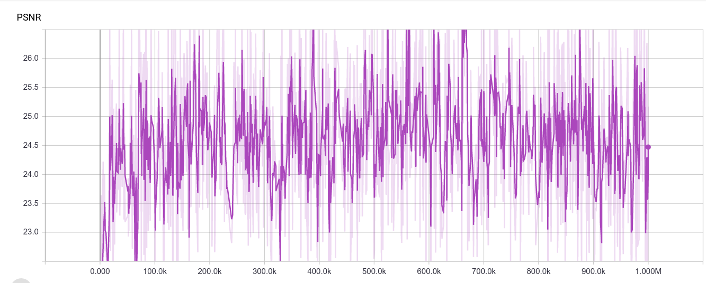</center>
		</td>
		<td>
			<center>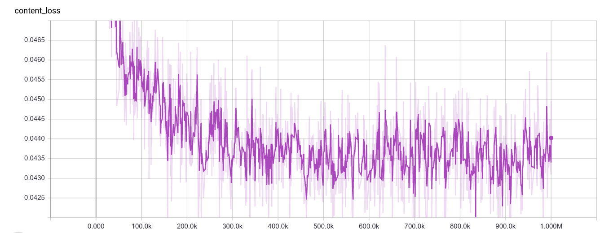</center>
		</td>
	</tr>
</table>

#### Train SRGAN with MSE loss
Edit the train_SRGAN.sh
```bash
#!/usr/bin/env bash
CUDA_VISIBLE_DEVICES=0 python main.py \
    --output_dir ./experiment_SRGAN_MSE/ \      #Set the place to put the checkpoint and log. You can put it anywhere you like.
    --summary_dir ./experiment_SRGAN_MSE/log/ \
    --mode train \
    --is_training True \
    --task SRGAN \
    --batch_size 16 \
    --flip True \
    --random_crop True \
    --crop_size 24 \
    --input_dir_LR ./data/RAISE_LR/ \
    --input_dir_HR ./data/RAISE_HR/ \
    --num_resblock 16 \
    --perceptual_mode MSE \                    #Set the perceptual mode to MSE
    --name_queue_capacity 4096 \
    --image_queue_capacity 4096 \
    --ratio 0.001 \
    --learning_rate 0.0001 \
    --decay_step 250000 \                       #Set the decay step to 250000
    --decay_rate 0.1 \
    --stair True \
    --beta 0.9 \
    --max_iter 500000 \                         #Set max iteration to 500000
    --queue_thread 10 \
    --vgg_scaling 0.0061 \
    --pre_trained_model True \                  #Use the pre-trained model
    --checkpoint ./experiment_SRGAN_MSE/model-500000       #Set the pre-trainde model you want to load
```
 After ensuring the configuration. execute the script:
```bash
# Executing the script
cd $SRGAN-tensorflow_ROOT/
sh train_SRGAN.sh
```
Launch the tensorboard to monitor the training process
```bash
# Launch the tensorboard
cd ./experiment_SRGAN_MSE/log/
tensorboard --logdir . 
# Now you can navigate to tensorboard in your browser
```
The training process in the tensorboard should be like this
<table>
	<tr>
		<td><center>PSNR</center></td>
		<td><center>content loss</center></td>
		<td><center>adversarial loss</center></td>
		<td><center>discriminator loss</center></td>
	</tr>
	<tr>
		<td>
			<center>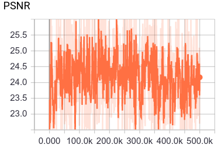</center>
		</td>
		<td>
			<center>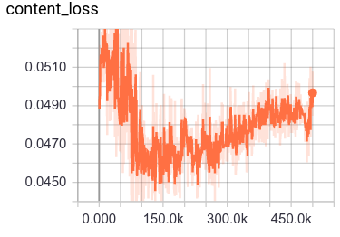</center>
		</td>
		<td>
			<center>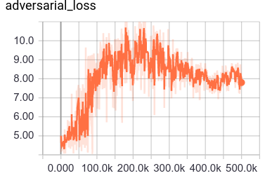</center>
		</td>
		<td>
			<center>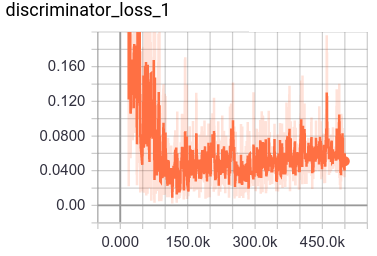</center>
		</td>
	</tr>
</table>

#### Train SRGAN with VGG54 perceptual loss
modify the train_SRGAN.sh
```bash
#!/usr/bin/env bash
CUDA_VISIBLE_DEVICES=0 python main.py \              #Set the place to put the checkpoint and log. You can put it anywhere you like.
    --output_dir ./experiment_SRGAN_VGG54/ \
    --summary_dir ./experiment_SRGAN_VGG54/log/ \
    --mode train \
    --is_training True \
    --task SRGAN \
    --batch_size 16 \
    --flip True \
    --random_crop True \
    --crop_size 24 \
    --input_dir_LR ./data/RAISE_LR/ \
    --input_dir_HR ./data/RAISE_HR/ \
    --num_resblock 16 \
    --perceptual_mode VGG54 \                         # Set the perceptual mode to VGG54
    --name_queue_capacity 4096 \
    --image_queue_capacity 4096 \
    --ratio 0.001 \
    --learning_rate 0.0001 \
    --decay_step 100000 \                             # Set the decay step to 100000 to follow the settings on the paper
    --decay_rate 0.1 \
    --stair True \
    --beta 0.9 \
    --max_iter 200000 \                               # Set the max_iter to 200000 to follow the settings on the paper
    --queue_thread 10 \
    --vgg_scaling 0.0061 \
    --pre_trained_model True \
    --checkpoint ./experiment_SRGAN_MSE/model-500000     #Load the weights of the model from the SRGAN with MSE loss
```
After ensuring the configuration. execute the script:
```bash
# Executing the script
cd $SRGAN-tensorflow_ROOT/
sh train_SRGAN.sh
```
Launch tensorboard to monitor the training process
```bash
# Launch the tensorboard
cd ./experiment_SRGAN_VGG54/log/
tensorboard --logdir . 
# Now you can navigate to tensorboard in your browser
```
The training process in the tensorboard should be like this
<table>
	<tr>
		<td><center>PSNR</center></td>
		<td><center>content loss</center></td>
		<td><center>adversarial loss</center></td>
		<td><center>discriminator loss</center></td>
	</tr>
	<tr>
		<td>
			<center>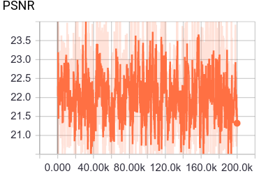</center>
		</td>
		<td>
			<center>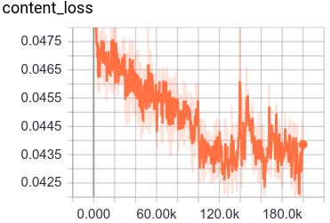</center>
		</td>
		<td>
			<center>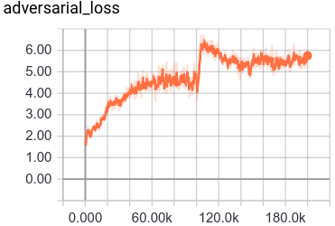</center>
		</td>
		<td>
			<center>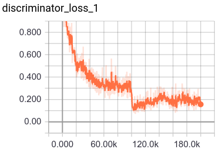</center>
		</td>
	</tr>
</table>

### More result on benchmark

#### Coming soon!!!

### Reference
* [C. Ledig, L. Theis, F. Huszar, J. Caballero, A. Cunningham, A. Acosta, A. Aitken, A. Tejani, J. Totz, Z. Wang, W. Shi, Photo-Realistic Single Image Super-Resolution Using a Generative Adversarial Network, accepted at CVPR (oral), 2017.](https://arxiv.org/pdf/1609.04802.pdf)
* [D.-T. Dang-Nguyen, C. Pasquini, V. Conotter, G. Boato, RAISE – A Raw Images Dataset for Digital Image Forensics, ACM Multimedia Systems, Portland, Oregon, March 18-20, 2015".](http://mmlab.science.unitn.it/RAISE/)
* [Isola, P., Zhu, J.Y., Zhou, T., Efros, A.A. Image-to-Image Translation with Conditional Adversarial Networks CVPR, 2017.](https://arxiv.org/pdf/1611.07004v1.pdf)
* [pix2pix-tensorflow](https://github.com/affinelayer/pix2pix-tensorflow)
